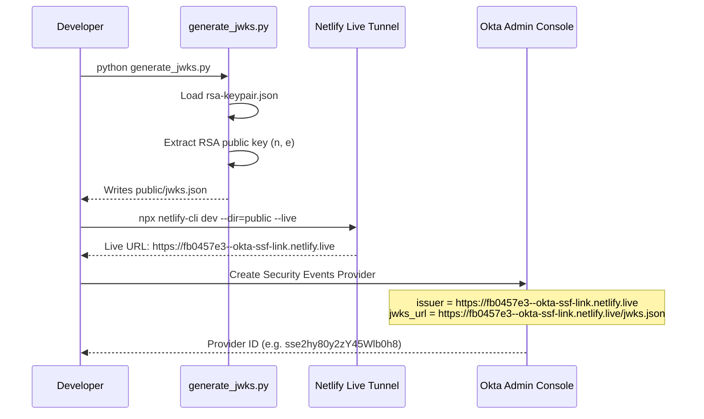
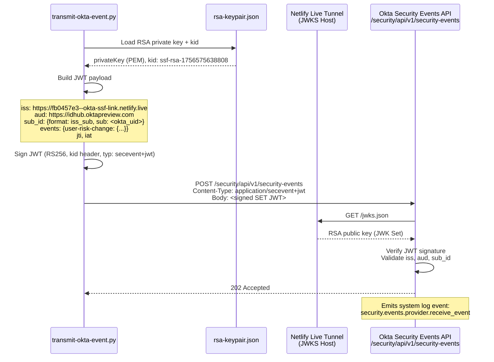
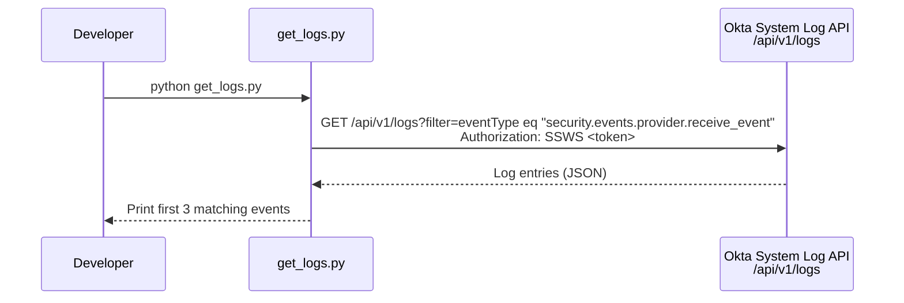

# Okta SSF Event Transmitter — Architecture

## Overview

This system implements an **inbound Security Event Transmitter** for Okta using the [Shared Signals Framework (SSF)](https://openid.net/wg/sharedsignals/) specification. It generates cryptographically signed Security Event Tokens (SETs) and pushes them to Okta's Security Events API, enabling external systems to notify Okta of user risk changes.

---

## Component Overview

| Component | File | Role |
|---|---|---|
| Key Setup | `generate_jwks.py` | Derives public JWKS from RSA keypair for Okta to verify signatures |
| Live JWKS Host | Netlify Dev + Live Tunnel | Serves `public/jwks.json` at a public URL during local development |
| Event Transmitter | `transmit-okta-event.py` | Builds, signs, and POSTs the SET JWT to Okta |
| Log Inspector | `get_logs.py` | Queries Okta System Log to verify event receipt |
| Key Material | `rsa-keypair.json` | RSA-2048 private/public keypair used for RS256 signing |
| Public Key | `public/jwks.json` | JWK Set (public key only) served to Okta for signature verification |

---

## Setup Sequence

One-time setup to establish trust between this transmitter and Okta.



---

## Event Transmission Sequence

Runtime flow for transmitting a `user-risk-change` event to Okta.



---

## Verification Sequence

After transmission, confirm Okta received and processed the event.



---

## JWT Structure

The signed SET (Security Event Token) sent to Okta:

**Header**
```json
{
  "alg": "RS256",
  "kid": "ssf-rsa-1756575638808",
  "typ": "secevent+jwt"
}
```

**Payload**
```json
{
  "iss": "https://fb0457e3--okta-ssf-link.netlify.live",
  "aud": "https://idhub.oktapreview.com",
  "iat": 1776131674,
  "jti": "<uuid>",
  "sub_id": {
    "format": "iss_sub",
    "iss": "https://fb0457e3--okta-ssf-link.netlify.live",
    "sub": "<okta_user_uid>"
  },
  "events": {
    "https://schemas.okta.com/secevent/okta/event-type/user-risk-change": {
      "current_level": "low",
      "previous_level": "medium",
      "event_timestamp": 1776131674,
      "initiating_entity": "admin",
      "reason_admin": { "en": "Elevated risk detected via SSF transmitter" },
      "reason_user": { "en": "Your account risk level was updated" },
      "subject": {
        "format": "iss_sub",
        "iss": "https://idhub.oktapreview.com",
        "sub": "<okta_user_uid>"
      }
    }
  }
}
```

---

## Key Constraint: `iss` Must Match Provider Registration

Okta looks up the Security Events Provider by the `iss` claim in the incoming JWT. If `iss` does not exactly match the `issuer` field registered in the provider config, Okta returns `400 Bad Request` with an empty body.

The registered provider config can be inspected via:
```
GET https://{OKTA_DOMAIN}/api/v1/security-events-providers/{PROVIDER_ID}
Authorization: SSWS <token>
```
